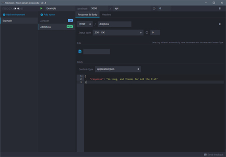

*Mock servers in seconds*

---

## What is it? 

Mockoon is a free server mocking tool built with Electron and available on Windows, Linux and MacOS. You can download it here: [mockoon.com](https://mockoon.com)

Feel free to test it and give some feedback!

## Give feedback

All feedback is welcomed. But please follow these simple guidelines before submitting a new feature or a bug:

- search the [opened issues](https://github.com/255kb/mockoon/issues) before opening any issue
- try to give maximum details in order to reproduce the bug (providing the mock data you used could be useful)
- purpose of Mockoon is to be simple, fast, easy to use, so keep in mind that most features **may not be implemented**! On purpose.

## More to come

If you want to know what will be coming in the next releases you ou can check the [milestones](https://github.com/255kb/mockoon/milestones) or directly check the features requests [here](https://github.com/255kb/mockoon/labels/feature).

New releases will also be announced on my personal [Twitter account @255kb](https://twitter.com/255kb).

